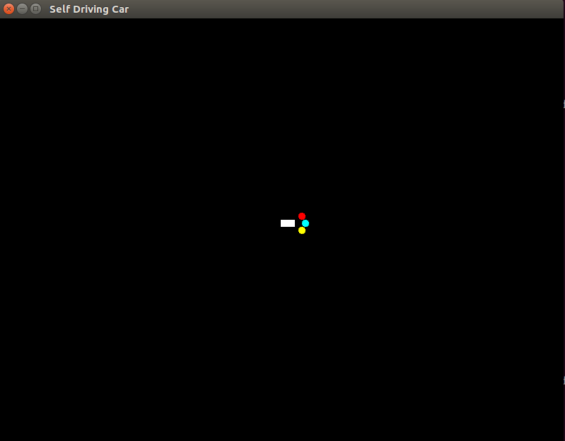

# Must read tutorials
- https://kivy.org/docs/tutorials/pong.html
- https://kivy.org/docs/tutorials/firstwidget.html
- https://stackoverflow.com/questions/17280341/how-do-you-check-for-keyboard-events-with-kivy

# Step 1:
- Lets start putting a small car in our virtual  environment 

- So basically we have two pieces, working toghether: 
    - .kv file, that defines how the shapes should be
    - A python file that control those shapes
- In our first step, we have [self_drive_env.py](self_drive_env.py) and [selfdrive.kv](selfdrive.kv)
- Ok, our car is a simple rectangle with three eliipse as its sensors. 
 I know it doesn't look a like car, you have to bare with it as I didn't get a nice example/tutorial, so that I can do Ctrl+C & Ctrl+V  here ;)

